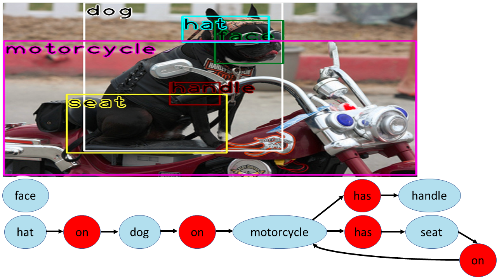
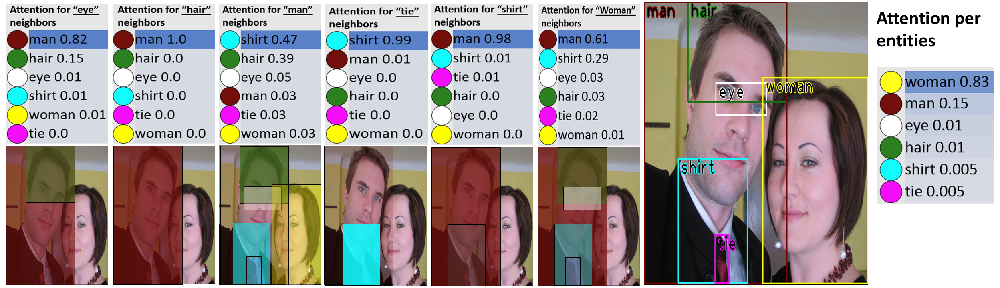

# Scene Graphs with Permutation-Invariant Structured Prediction
<!---[alt text](sg_example_final.png)--->



## Introduction
Scene graph prediction is the task of mapping an image into a set of bounding boxes, along with their categories and relations (e.g., see [2, 3, 4, 5, 6]).
<!--- In the scene graph prediction task (e.g., see [2, 3, 4, 5, 6]), the input is an image annotated with a set of bounding boxes. The goal is to label each bounding box with the correct entity category, and every pair of entities with their relation, such that they form a coherent graph, known as a scene graph. --->

In the paper [Scene Graphs with Permutation-Invariant Structured Prediction](https://arxiv.org/abs/1802.05451) (2018) [1] we present a new architecture for graph inference that has the **following structural property**:
on the one hand, the architecture is invariant to input permutations; 
on the other hand, every permutation-invariant function can be implemented via this architecture.

In this repository, we share our architecture implementation for the task of scene graph prediction.

## Model implementation
Our model has two components: A **Label Predictor (LP)** that takes as input an image with bounding boxes and outputs a distribution over labels for each entity and relation.
Then, a **Scene Graph Predictor (SGP)** that takes all label distributions and predicts more consistent label distributions jointly for all entities and relations. SGP satisfies the graph permutation invariance property intoduced in the paper.
The repository includes just the SGP model which gets as input a label distribution that created a head by our LP over [VisualGenome dataset](https://visualgenome.org).
The model is implemented in [TensorFlow](https://www.tensorflow.org/).


## SGP architecture
Our SGP implementation is using an iteratively RNN to process predictions. Each step outputs an improved predictions.


A schematic representation of the architecture. Given an image, our LP model outputs initial predictions . Then, our SGP model, computes each  element wise. Next, they are summed to create vector , which is concatenated with . Then,  is applied, and another summation creates the graph representation. Finally,  classifies objects and  classifies relation. The process of SGP could be repeated iteratively (in the paper we repeat it 3 times).

For more information, please look at the code (Module/Module.py file) and the paper.


## Attention with SGP architecture
Our SGP architecture uses attention at the feature-level for each node during inference. 
We weight the significance of each feature per node, such that the network can choose which features from adjacent nodes contributes the most information.



An example of attention per entities and global attention over all nodes. The size and location of objects provide a key signal to the attention mechanism. The model assigns higher confidence for the label "tie" when the label "shirt" is detected (third panel from the left). Similarly, the model assigns a higher confidence for the label "eye" when it is located near "hair".

## Dependencies
To get started with the framework, install the following dependencies:
- [Python 2.7](https://www.python.org/)
- [tensorflow-gpu 1.0.1](https://www.tensorflow.org/)
- [matplotlib 2.0.2](http://matplotlib.org/)
- [h5py 2.7.0](http://www.h5py.org/)
- [numpy 1.12.1](http://www.numpy.org/)
- [pyyaml 3.12](https://pypi.python.org/pypi/PyYAML)

Run `"pip install -r requirements.txt"`  - to install all the requirements.


## Usage
1. Run `"python Run.py download"` to download and extract train, validation and test data (the data includes the initial label distribution that created a head by our LP)
2. Run `"python Run.py eval gpi_linguistic_pretrained <gpu-number>"` to evaluate the pre-trained model of our best variant, linguistic with multi-head attention. (recall@100 SG Classification).
3. Run `"python Run.py train gpi_linguistic <gpu-number>"` to train a new model (linguistic with multi-head attention).
4. Run `"python Run.py eval gpi_linguistic_best <gpu-number>"` to evaluate the new model. (recall@100 SG Classification).


## About this repository
This repository contains an implementation of our best variant (Linguistic with multi-head attention) of the Scene Graph Prediction (SGP) model introduced in the paper [Scene Graphs with Permutation-Invariant Structured Prediction](https://arxiv.org/abs/1802.05451).
Specifically, the repository allow to run scene-graph classification (recall@100) evaluation script on our pre-trained model or alternatively (1) train an SGP model (2) evaluate the trained model using scene-graph classification (recall@100) evaluation script.


## References
[1] Roei Herzig, Moshiko Raboh, Gal Chechik, Jonathan Berant, Amir Globerson, [Mapping Images to Scene Graphs with Permutation-Invariant Structured Prediction](https://arxiv.org/abs/1802.05451), 2018.

[2] Justin Johnson, Ranjay Krishna, Michael Stark, Li Jia Li, David A. Shamma, Michael S. Bernstein, Fei Fei Li, [Image Retrieval using Scene Graphs](http://hci.stanford.edu/publications/2015/scenegraphs/JohnsonCVPR2015.pdf), CVPR, 2015.

[3] Cewu Lu, Ranjay Krishna, Michael S. Bernstein, Fei Fei Li, [Visual Relationship Detection with Language Priors](https://cs.stanford.edu/people/ranjaykrishna/vrd/vrd.pdf), ECCV, 2016.

[4] Xu, Danfei and Zhu, Yuke and Choy, Christopher and Fei-Fei, Li, [Scene Graph Generation by Iterative Message Passing](https://arxiv.org/pdf/1701.02426.pdf), CVPR, 2017.

[5] Alejandro Newell and Jia Deng, [Pixels to Graphs by Associative Embedding](https://papers.nips.cc/paper/6812-pixels-to-graphs-by-associative-embedding.pdf), NIPS, 2017.

[6] Rowan Zellers, Mark Yatskar, Sam Thomson, Yejin Choi, [Neural Motifs: Scene Graph Parsing with Global Context](https://arxiv.org/pdf/1711.06640.pdf), CVPR, 2018.

## Cite
Please cite our paper if you use this code in your own work:
```
@article{hr2018img2sg_perminv,
  author    = {Roei Herzig and
               Moshiko Raboh and
               Gal Chechik and
               Jonathan Berant and
               Amir Globerson},
  title     = {Mapping Images to Scene Graphs with Permutation-Invariant Structured
               Prediction},
  journal   = {arXiv preprint arXiv:1802.05451},
  year      = {2018}
}
```
